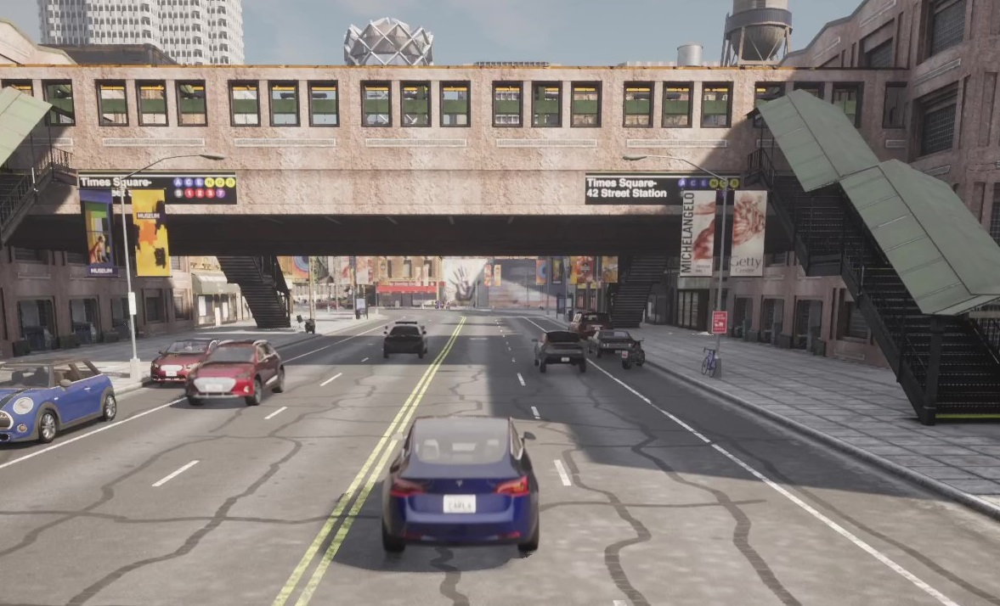
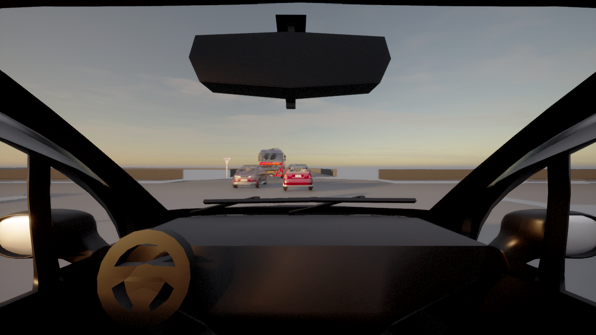

# Examples

## 01 OpenDRIVE & OpenSCENARIO

Example for an OpenSCENARIO on an OpenDRIVE map.
The scenario contains a config defined third person camera sensor on vehicle, an object lidar and a reflection based radar.

## 02 Replay Trajectories

Replays trajectories of one ego vehicle and three other vehicles.
The trajectories are loaded by one OSMP-Service.

## 03 Replay Trajectories with sensor

Replays the same trajectories as in 01.
Additionally config defined camera sensors are placed on two vehicles.
A second OSMP-Service loads the sensor FMU and configures it with given parameters, like _profile_ = SCALA\_1, Ibeo\_LUX\_2010, LongRange\_Radar or MidRange\_Radar.
The [FMU](https://github.com/openMSL/sl-1-3-object-based-generic-perception-object-model) receives a SensorView message with all GroundTruth information.
The third OSMP-Services saves the SensorView and the SensorData messages.

## 04 OSMP Openloop without Carla

OSTAR enables simulation runs without Carla and replaces it with a dummy.
This example reads the replay in the first OSMP-Service and saves it with the second OSMP-Service.
Other FMUs can be configured to receive inputs from the reading OSMP-Service and write its output to the writing OSMP-Service.

## 05 OSMP Proxy

Uses a compatible functionality of the [OSMPCNetworkProxy FMU](https://github.com/OpenSimulationInterface/osi-sensor-model-packaging) to connect via TCP connection.
Should be used with care since only OSI messages are transmitted.
Simulation control messages are not supported by this interface, like _doStep_ or _endSimulation_.
Since it is not used frequently there is no easy example.
Just get in touch with us, if you need help with this feature.

## 06 Static Sensor

Replays trajectories of one ego vehicle and three other vehicles.
OSTAR creates and configures a camera sensor in world coordinates.
The image is saved as an OSI trace file.
Additionally each image is saved by the receiving OSMP-Service as a separate png file.
Lidar and Radar sensors work similar to this example.
OSMP-Service currently only has a spcific behavior for camera images in the sensorview message.

## 07 Advanced sensors: Radar sensor by FMU

Replays trajectories of one ego vehicle and three other vehicles.
OSTAR creates and configures a radar sensor based on a given FMU, like the [openMSL model](https://github.com/openMSL/sl-1-1-reflection-based-radar-object-model) on the ego vehicle.
Camera and Lidar sensors work similar to this example.
To get the sensors spawned by the FMU itself you need to use OSMPSensorView[x] to get the corresponding sensor input.

## 08 SUMO integration

The [SUMO](https://eclipse.dev/sumo/) integration uses SUMO to create a scenario and surrounding traffic.
This example contains the following SUMO files: sumoexample.net.xml, sumoexample.rou.xml, sumoexample.settings.xml and sumoexample.sumoconfig.

To create a SUMO net file from the opendrive file use option **--offset.disable-normalization true** in netconvert.
Otherwise use **-replayMapOffsets \<X\> \<Y\>** as additional_parameters in [configuration](https://github.com/DLR-TS/OSTAR-Quickstart/tree/main/docu/Configuration.md) and fill in the netOffset from the sumo net file manually.

Note that the stepsize needs to be the same in both configurations.

## 09 Distributed simulation

Example for an OpenSCENARIO on an OpenDRIVE map with Carla running on a different system.
Change the IP and port to your Carla instance.
configDistributedSimulation.yml is loaded by CoSiMa and contains the configuration of the FMUs.
A CARLA simulation must be running with a vehicle called **hero**.
This vehicle will get additional sensors by OSTAR.
It is also possible to run OSMP-Services in differen environments like Windows to integrate FMUs build only for Windows.

